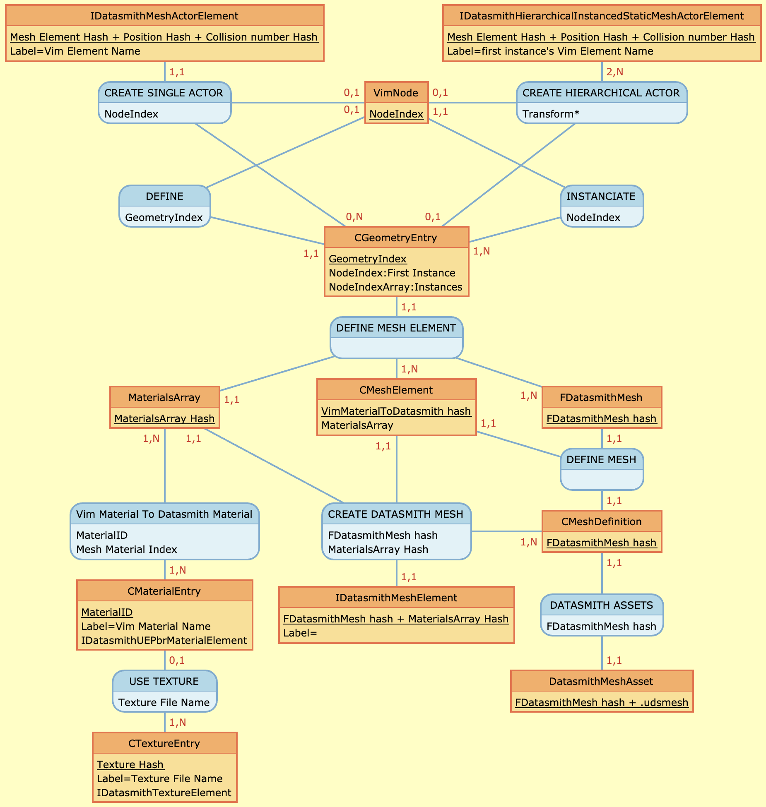

# vim-datasmith
A **VIM to DataSmith** converter. 

## Build requirements
* You must build the Datasmith SDK
	* With Git
		* For that you need to get Unreal Engine git repository. Branch 4.27
		* For mac OS : Replace the files with the ones provided vim-datasmith/Settings folder.
			* "Engine/Source/Programs/Enterprise/Datasmith/DatasmithSDK/DatasmithSDK.Target.cs"
			* "Engine/Source/Programs/Enterprise/Datasmith/DatasmithSDK/DatasmithSDK.Build.cs"
		* Run "Setup.command"
		* Run GenerateProjectFiles.command
		* Open the UE4 project and build scheme "DatasmithSDK"
	* With Perforce
		* Just use the force (a lots) and everything will goes well.
	* In the file 
		* In Vim-Datasmith.xcconfig - Edit "DatasmithSDKFolder" for the real path of your builded SDK
	* At this point you are ready to build the converter application.

Good Luck

Richard Young


## Current status

The current version is the basis of the final product, it lacks:
* Geometry:
	* UV coordinate processing
	* Determine pivot (i.e. not 0, 0, 0) for objects without transformations

* Materials:
	* A flag to use or not the textures.
	* Refine the material settings.

* Naming:
	* The converter use hashing to name Datasmith elements (Actor, Mesh, Metadata, Textures...)
	* Until VIM defines GUIDs for its elements, this approach will minimize reimports in Datasmith importers.

## Entity relations

Here is a simplified entity relationships diagram. The goal is to allow a quick visualization of the chosen approach to convert between the vim elements and those of Datasmith.




This diagram have been done with: [MoCoDo online](http://mocodo.wingi.net).
Paste it text from file: [Documentation/VimToDatasmithMCD.txt](Documentation/VimToDatasmithMCD.txt)

## Strong Typing
In VIM, almost all data is referred by index. In order to improve the readability of the code and reduce the errors that could result from it, I typed all these indexes and created encapsulations (see TVector template) for their containers
```
// Here are all VIM index. Use of enum to get some type checking
enum ElementIndex : uint32_t { kNoElement = (uint32_t)-1 };
enum NodeIndex : uint32_t { kNoNode = (uint32_t)-1 };
enum GeometryIndex : uint32_t { kNoGeometry = (uint32_t)-1 };
enum ParentIndex : uint32_t { kNoParent = (uint32_t)-1 };
enum VertexIndex : uint32_t { kInvalidVertex = (uint32_t)-1 };
enum GroupIndex : uint32_t { kInvalidGroup = (uint32_t)-1 };
enum MaterialId : uint32_t { kInvalidMaterial = (uint32_t)-1 };
enum IndiceIndex : uint32_t { kInvalidIndice = (uint32_t)-1 };
enum FaceIndex : uint32_t { kInvalidFace = (uint32_t)-1 }; // FaceIndex is same as Indices index / 3
enum StringIndex : uint32_t { kInvalidString = (uint32_t)-1 };

// Basic vector class
template <class C, class Indexor = std::size_t> class TVector {
	...
};
```

## Development tools

DebugTools provide services to do all invariants tests (this code use a lots of them) and to do reports.

TimeStat permit to measure CPU and realtime taken for a code to execute. Note that CPU can be between ]0..CPUcount] * realtime.
	(Ex. 1 - On a 20 CPU machine, you can execute up 20 CPU seconds in 1 real seconds)
	(Ex. 2 - Can be less than one if process is waiting for ressources (disk access))

TaskMgr create a CPU count threads pool.
	- You can add task and join all of them when needed.
	- You can also use CTaskJointer and add it joinable task or functor task.
	
## Datasmith tools

DatasmithHashTool and DatasmithSceneValidator are tool extracted from UnrealEngine/Engine/Source/Programs/Enterprise/Datasmith/DatasmithARCHICADExporter.
They got some adjustment to compile in VimToDatasmith.
